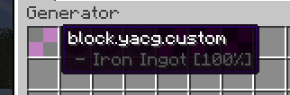
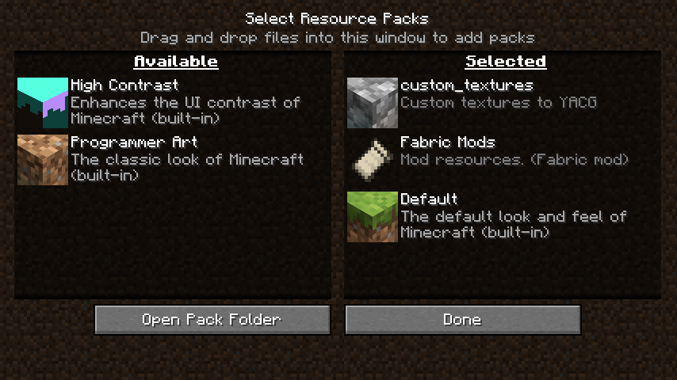
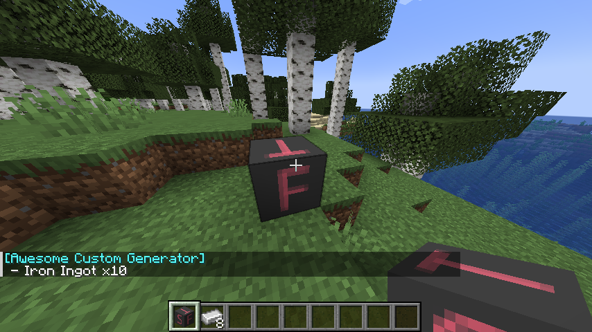
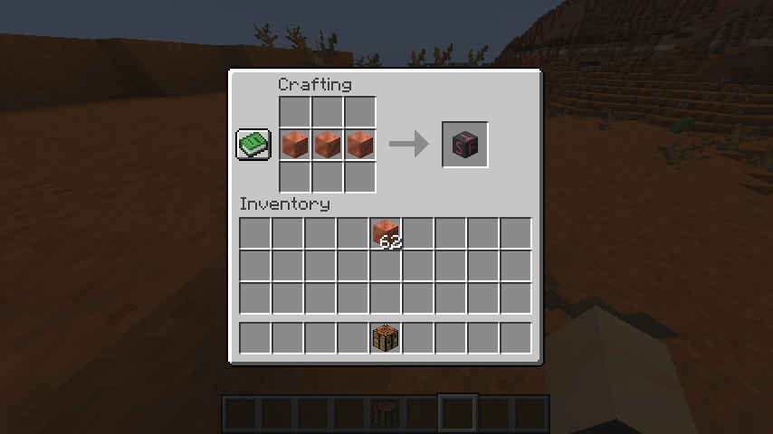

# How to create custom generator

Open `./config/yacg/config.json` and add `custom` generator

```json
{
    "generators": {
        "custom": [
            {
                "itemId": "minecraft:iron_ingot",
                "coefficient": 100,
                "count": 2
            }
        ],
        "cobble": [
           
        ],
    }
}
```

After restart game you can see it in creative menu.



Now we need to attach next things.

* [Textures and models](#textures-and-models)
* [Localization](#localization)
* [Craft](#craft)
* [Mining possibility](#mining-possibility)

You can download that example files and edit it how u need [custom_textures.zip]() and [custom_data.zip]().

### Textures and models

Textures and models require multiply files.

* BlockState locate in`./resourcepacks/custom_textures/assets/yacg/blockstates/` file name should be same like generator
  id. In that example it is `custom.json`. It contains logic for block rotation on placment.

  ```json
  {
    "variants": {
      "facing=north": {
        "model": "yacg:block/custom"
      },
      "facing=east": {
        "model": "yacg:block/custom",
        "y": 90
      },
      "facing=south": {
        "model": "yacg:block/custom",
        "y": 180
      },
      "facing=west": {
        "model": "yacg:block/custom",
        "y": 270
      }
    }
  }
  ```

* Textures locate in `./resourcepacks/custom_textures/assets/yacg/textures/block/custom/` In that folder you can find 5
  files. Like names says it different sides textures.

* back.png
* bottom.png
* front.png
* side.png
* top.png

* Models locate in 2 directory `./resourcepacks/custom_textures/assets/yacg/models/`

    * `item` - contains item in hand model

  ```json
  {
    "parent": "yacg:block/custom"
  }
  ```

    * `block` - contains block texture settings for block

  ```json
  {
    "parent": "block/cube_all",
    "textures": {
      "down": "yacg:block/custom/bottom",
      "east": "yacg:block/custom/side",
      "north": "yacg:block/custom/front",
      "south": "yacg:block/custom/back",
      "up": "yacg:block/custom/top",
      "west": "yacg:block/custom/side",
      "particle": "yacg:block/custom/side"
    }
  }
  ```

  It both should be `custom.json`



### Localization

It should locate in `./resourcepacks/custom_textures/assets/yacg/lang/`. By default it contains only `en_us.json` that
is English localization file. U can see other available locales
on [minecraft wiki](https://minecraft.fandom.com/wiki/Language).

```json
{
  "block.yacg.custom": "Awesome Custom Generator"
}
```



### Craft

> **I recommend add crafts using KubeJS or something else. Because datapacks that this tutorial use can be installed
only after world created or if you manually select it from datapacks for world. Also I can recommend
that [mod](https://modrinth.com/mod/datapacks) for make global datapacks . Next locations is write for that mod**

It should locate in `./datapacks/custom.zip(/data/yacg/recipes/)` I recommend to use as file name same id that you used
for generator. In that example it will be `custom.json`.

```json
{
  "type": "minecraft:crafting_shaped",
  "pattern": [
    "   ",
    "CCC",
    "   "
  ],
  "key": {
    "C": {
      "item": "minecraft:copper_block"
    }
  },
  "result": {
    "item": "yacg:custom",
    "count": 1
  }
}
```



### Mining possibility

That also required 2 file.

* `./datapacks/custom_data.zip(/data/minecraft/tags/blocks/mineable/pickaxe.json)` With that file we allow to mine us
  generator using pickaxes.

  ```json
  {
    "replace": false,
    "values": [
      "yacg:custom"
    ]
  }
  ```

* `./datapacks/custom_data.zip(/data/yacg/loot_tables/blocks/custom.json)` With that file we add self drop for us
  generator.

  ```json
  {
    "type": "minecraft:block",
    "pools": [
      {
        "bonus_rolls": 0.0,
        "conditions": [
          {
            "condition": "minecraft:survives_explosion"
          }
        ],
        "entries": [
          {
            "type": "minecraft:item",
            "name": "yacg:custom"
          }
        ],
        "rolls": 1.0
      }
    ]
  }
  ```

  